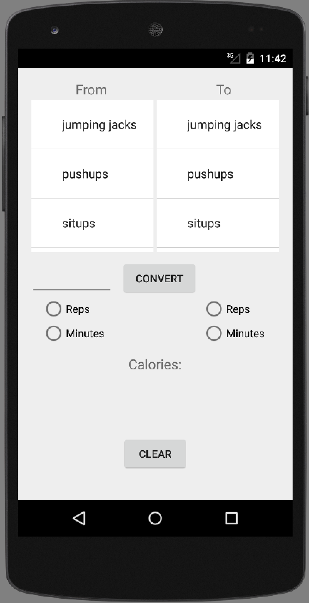
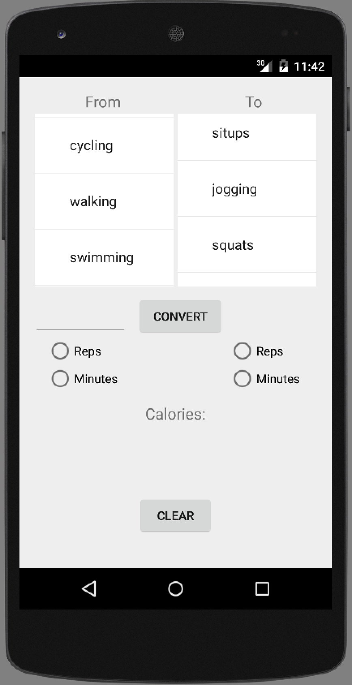
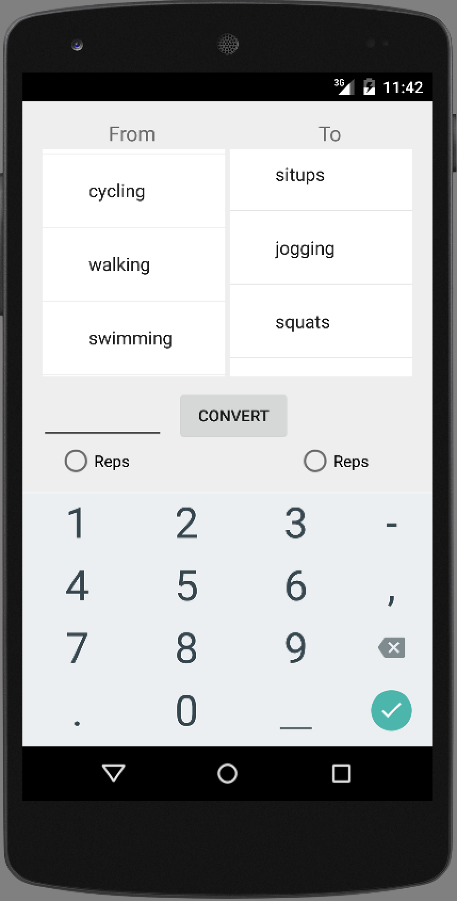
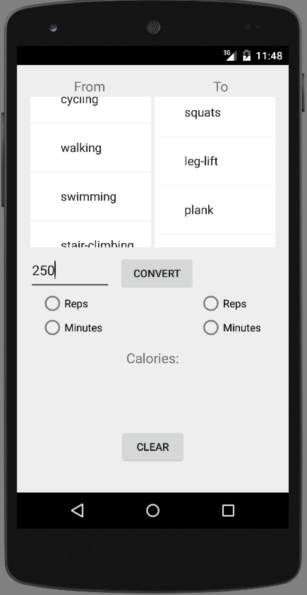
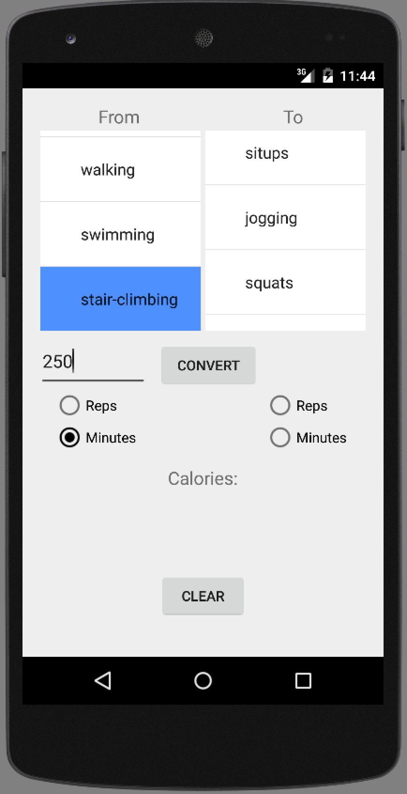
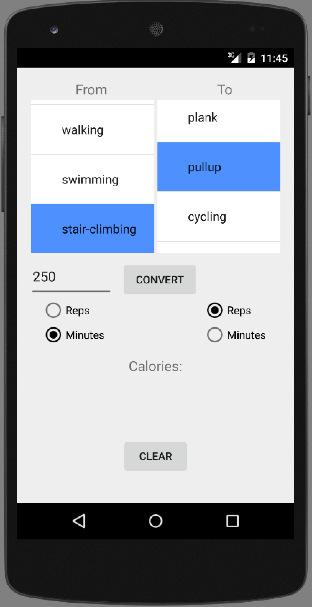
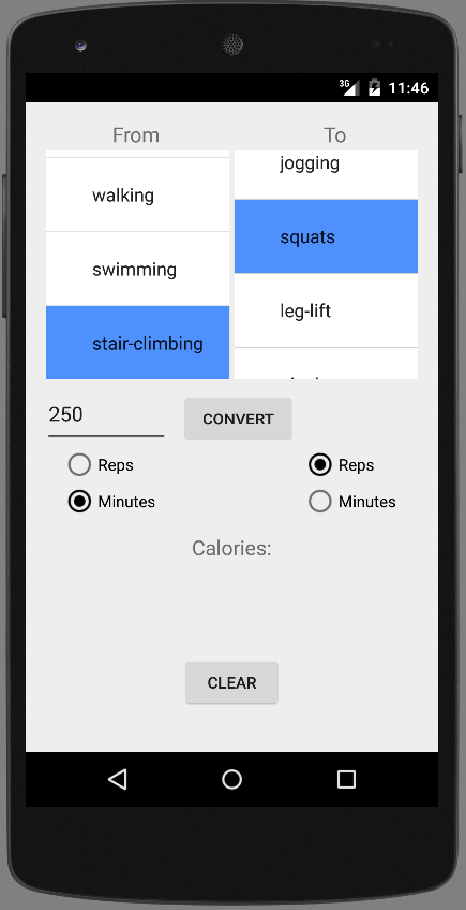
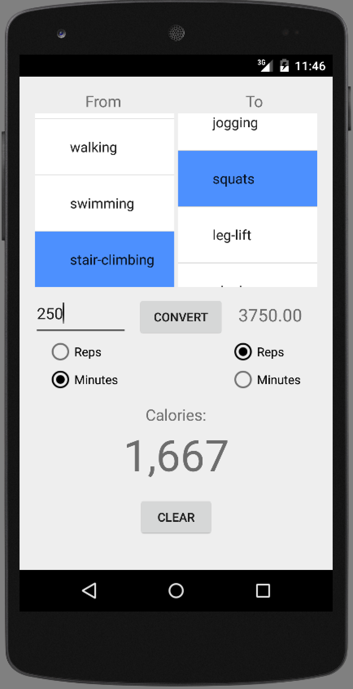

# PROG 01: Crunch Time

Crunch Time is an Android app to help those who are short on time but still want to maintain a fit and active lifestyle. Given an input of the type and amount of exercise, you’ll be able to see how many calories you’ve burned as well as the equivalent amount of another type of exercise. Exercises currently supported include: pushups, situps, squats, leg-lifts, planks, jumping jacks, pullups, cycling, walking, jogging, swimming, and stair-climbing.

## Authors

Audrey Leung ([audreycml@berkeley.edu](mailto:your_email@berkeley.edu))

## Demo Video

See [Crunch Time App (CS260A Spring 2016)] (https://youtu.be/MZRQgCjjJ8o)

## Screenshots

## Acknowledgments

* Android Tutorial: https://www.udemy.com/the-complete-android-developer-course/

